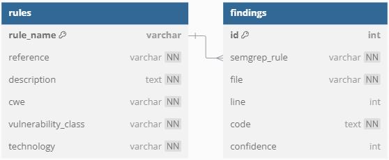

# Semgrep JSON to SQLite Parser

This Python tool is designed to parse the JSON output of a Semgrep scan, and store the parsed data into an SQLite database file. It uses Python's built-in `sqlite3` library for database operations.

## Features

- Reads and parses a Semgrep scan output JSON file.
- Converts the most relevant parsed data into an SQLite database.
- Automatically generates the SQLite database schema based on the JSON structure.

## Requirements

- Python 3

## Installation

Clone the repository:

```bash
https://github.com/PolEspurnes/Semgrep-JSON-to-SQLite-Parser.git
cd Semgrep-JSON-to-SQLite-Parser
```


## Usage

The tool can be used directly from the command line. It requires the input JSON file as a mandatory argument and an optional output SQLite database file name.

### Basic Command

```bash
python semgrep_to_sqlite.py input.json -o output.db
```

### Arguments

- `input.json`: The Semgrep scan output JSON file that you want to parse.
- `-o`, `--output_file` (optional): The name of the output SQLite database file. If not specified, the default is `output.db`.

### Example

```bash
python semgrep_to_sqlite.py semgrep_output.json -o semgrep_results.db
```

This command reads `semgrep_output.json` and stores the parsed data into `semgrep_results.db`. If no output file is specified, it will default to `output.db`.

## SQLite Database Schema



### SQLite Example Queries

The following are some example queries that can be used to easily extract the relevant information about the scan results.
```sql
SELECT COUNT(id) FROM findings
SELECT DISTINCT semgrep_rule FROM findings
SELECT id FROM findings WHERE confidence = 3
SELECT  id, semgrep_rule FROM findings WHERE confidence > 1
SELECT  semgrep_rule, file, code, line FROM findings WHERE id = 1
```
- **Note**: Confidence values. HIGH=3, MEDIUM=2 and LOW=1.

## Contributions

Contributions are welcome! Please submit a pull request or open an issue for any bugs or feature requests.